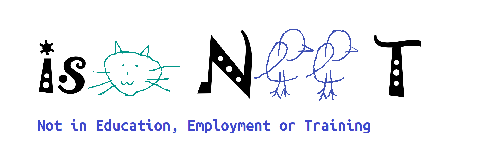

# 關於本站

## isoNEET 與 isoNerd

以前有個 isoNEET 網站，彼時的成員都是些整天躺在家裡打LOL、打魔物獵人、打Valorant、看動漫、耍廢的死研究生或大學生，當時覺得「NEET」很適合我們，畢竟是群不讀書的人：

|  |
| :---------------------: |
| *isoNEET 形象圖* |

沒想到大家後來都去上班了，只能說不勝唏噓，但仔細想想，畢竟還是群奇葩人士聚集的團體，所以我改名叫做 **isoNerd**，當然你想要 isoNEET 網域的話，可以 V 我 50 轉給你。

## 立站動機

就讀大學期間，我習慣用 Markdown 來做筆記。後來開始接學校的產學合作案，才發現同事能寫出一些匪夷所思的代碼，於是我就分享到朋友的 Discord 群組。由於當時不少人都有接產學案，所以也不乏一些精彩故事 —— 最後甚至開了一個專門分享身旁遇到的神人（當然，會去識別化與移除敏感資訊）。

久而久之，那個頻道不只是吐槽工作上的事情，也開始出現各種知識分享與技術討論：有人分享 g++ 的新版本、有人抱怨 snap 多糟、有人討論 AMD 晶片效能；當然也不乏「Oracle 又在告人、Intel 還在擠牙膏、Google 的官方文件寫的跟屎一樣」這些幹話。這種「半閒聊、半技術」的氣氛，反而讓資訊流動得更自然。

在之後，有人進了業界，有人去念研究所，而我則在台科研究所當了幾門課的助教。我很訝異，現在學生真的很厲害，可能因為資訊太容易取得。我大一時，問全班誰知道版本控制，七成以上都茫然；而現在幾乎人手一個 GitHub 帳號。只是教材仍有些落差，比如大學OOP教材還在 C++14，但主流工具鏈早已往前走，所以我還是會自己整理教材。畢竟總不能每次學生問問題時都說：「去問 AI」或「自己上網找一下資料」。

當我寫碩士論文時，速度比多數同學快上許多，我想是因為長期整理教材與撰寫文章的習慣，讓我對學術性文章的語氣和邏輯結構都特別熟悉。這也讓我意識到寫作其實是一種持續自我校正的練習，再加上我很常把一些常用的小工具、代碼片段寫在 Github 的 Gist，於是就有了架起該站的念頭。

:::warning[更新保證]

本網站不保證持續更新，高機率嫌麻煩了就不會更新了，叫做 Vibe 部落格也是因為嫌麻煩的時候會用 AI 水文。

:::

## AI 時代的部落格

我的看法是：AI 本質上還是一個統計模型。它的強項是從海量資料中抽出「最不出錯」的答案，也就是一種「平均值智慧」。這在主流領域表現得極好，比如 Web 開發、常見框架、API 使用範例，只要是資料夠多的議題，它都能回答得又快又準。但一旦問題超出主流路線，AI 的回覆就開始模糊了。比方說，你問它：「我要怎麼用 LLVM 的工具鏈，從 C++ 代碼生成具可移植性的 WASM 模組？」它可能還是會滔滔不絕地回答，但實際跑起來根本不行。因為那部分的訓練資料稀少、變化大，而真正能解決問題的知識往往藏在錯誤訊息裡、或某個論壇的討論串裡。

實際一點的例子，在公司裡你遇到的問題通常也不是「理論問題」，而是前人留下的上古屎山(當然，人類拉屎的能力也不比AI差)。那時候再強的模型也救不了你，你還是得靠只能靠基本功。所以筆記與部落格的價值，不是單純「記錄正確答案」，而是留下「思考過程」。學習從來不是避免出錯，而是主動去嘗試出錯。這和國中數學老師講的一樣：「不要只聽我講，自己拿筆算一次看看。」

最後，是我遇過一些 AI 信徒，完完全全 AI 說啥就信啥。後來我想開了：那不如我自己寫個 Blog，丟給 GPT 專案當 Context，再用 AI 幫我生成知識摘要，大多數魔法對轟的情況我都是穩贏的。

## 本站的內容

### 水文農場(Blog)

若有遇到「可展開說明」神奇的事件或是代碼，會嘗試說一下為什麼這件事很蠢，例如：

<details>
  <summary>神奇的事件一覽</summary>

  考慮到引起最多人迴響的仍然還是同事的靈光一現或是偽人行為，包括但不限於：

- 「覺得UUID會碰撞的主管」
- 「說不能用 Memory Cache，不然如果斷電怎麼辦的老害同事」
- 「配置VM時，搞不懂 Memory 與 Disk 的碩班學妹」
- 「同事給的代碼噴了上千個 Warning」
- 「不會用async function，全部用 `setTimeout` 排程的 JS 開發實習生」
- 「喜歡講『AWS 的 VPC 是假內網不能用』這種逼話的學長」
- 「這個 0.0.0.0/24 是開Port 24的意思嗎？」
- 「Git 使用 Force-Push 把整個專案進度蓋掉的天尊學弟」

Blog 可能會收錄這些故事
</details>

- 「認為要手動檢查UUID會不會碰撞的主管」 - 在 [RFC 9562](https://www.rfc-editor.org/rfc/rfc9562.html) 就提及

> The UUID generation algorithm described here supports very high allocation rates of 10 million per second per machine or more, if necessary, so that they could even be used as transaction IDs. UUIDs are of a fixed size (128 bits), which is reasonably small compared to other alternatives. This lends itself well to sorting, ordering, and hashing of all sorts; storing in databases; simple allocation; and ease of programming in general.

然後可能會簡單講一下 UUID 的算法怎麼防碰撞的。

- 「不會用 `async`/`await`，全部用 `setTimeout` 排程的 JS 開發實習生」

> 考慮以下代碼：

```js
async function schedule1() {
  // 假定 subTask 都會執行 1 秒
  await subTask1();
  await subTask2();
  await subTask3();
}

function schedule2() {
  setTimeout(subTask1, 0);
  setTimeout(subTask2, 1000);
  setTimeout(subTask3, 2000);
}
```

> 這兩個方法 不等價，差異非常大。雖然乍看之下它們都「依序執行三個子任務、每個任務耗時 1 秒」，但它們在執行模型與時間控制方式上根本不同。setTimeout 的本質是計算某個事件是否逾期了，若逾期則取出來執行；Async 則有 Await 的保證。
>
> `schedule1()` 的語意是「同步地依序執行非同步任務」，`schedule2()`的語意是「用計時器排程三個任務」。
> 如果 3 個 `subTask` 都在一秒內完成，那兩者的行為看起來類似；但是若 `subTask1` 執行了 3 秒， `schedule1` 會保證 `subTask2` 執行後才調用 `subTask3`，而 `schedule2` 則會把 `subTask2`, `subTask3` 同時調用。

Blog 的內容可能會類似這樣，當然也會包含一些開發上的小文章，或是分享一些妙妙工具。

### 主題文章

如果 Blog 的文章數量足夠，或者心血來潮想要整理一些主題的研究，就會建立不同的頁籤專門撰寫這些文章